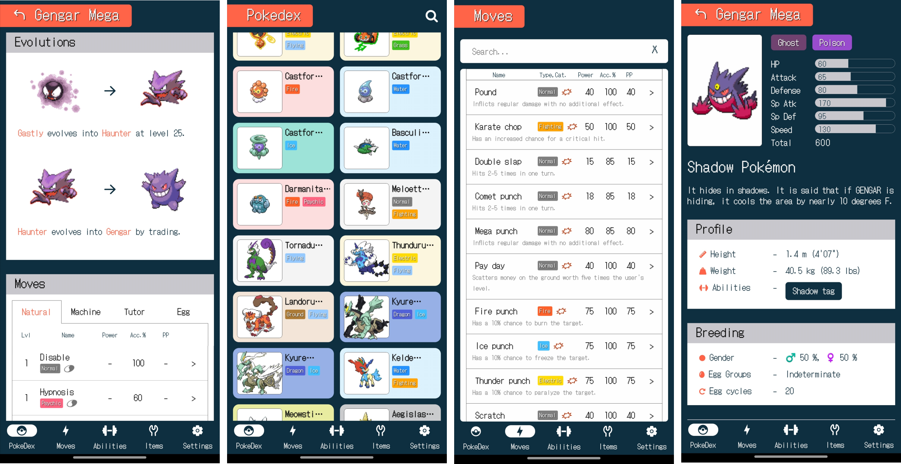

# Poke Info

Poke Info is a tool built with React Native (Expo) that provides useful information about different pokemon characters, their types, moves, evolutions, items, abilities and more. Users can use the app to look up for their favorite pokemon, item, move or ability by searching quick.

## Features

* A complete list of Pokémon with their visual images, types, abilities, moves, stats and evolution chart
* Easily search the Pokémon, Abilities, Items and Moves
* Type attack/defense effectiveness
* Abilities/Items/Moves basic information

## Built with
- [React Native ( TypeScript )](https://reactnative.dev/)
- [Expo](https://expo.dev/)
- [React Navigation](https://reactnavigation.org/)
- [Shopify Flash List](https://shopify.github.io/flash-list/)
- [PokeAPI Types](https://www.npmjs.com/package/pokeapi-types)
- [React Native Reanimated](https://docs.swmansion.com/react-native-reanimated/)

## API

PokeAPI: https://pokeapi.co/

