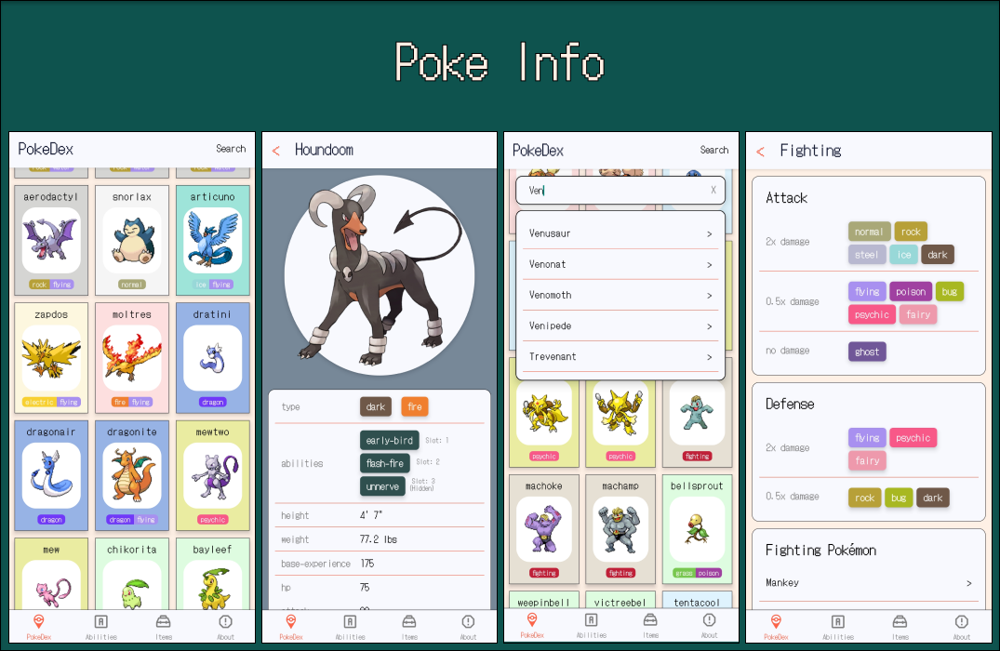

# Poke Info

a mobile app that consumes REST API from [PokeApi](https://pokeapi.co/).
It provides some useful information for all Pokémon, abilities, and items.

### features

* A complete list of Pokémon with their visual image, types, abilities and stats
* Easily search the Pokémon, Abilities and Items
* Type attack/defense effectiveness
* Abilities/Items basic description
